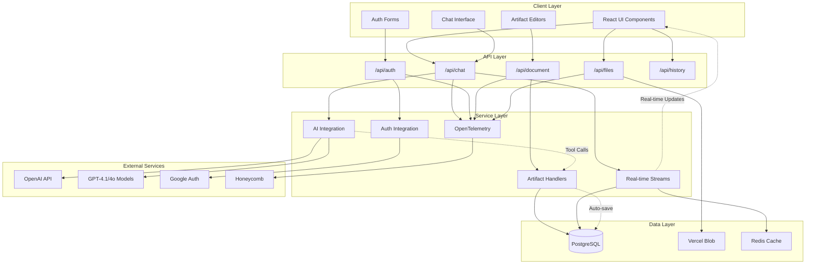

# Chat Gippidy

A modern AI chatbot application built with Next.js 15, featuring real-time conversations, interactive artifacts, and multi-user collaboration.

## Architecture Overview

Chat Gippidy is a full-stack application that combines real-time AI chat with an innovative artifacts system for creating and editing interactive content. The application follows a modular architecture with clear separation of concerns across authentication, chat management, artifact handling, and database operations.

### System Architecture

### Data Flow

#### Chat Message Flow
1. **User Input** → `MultimodalInput` component captures text and file attachments
2. **Request Processing** → `useChat` hook formats request and sends to `/api/chat`
3. **AI Processing** → OpenAI models generate responses with optional tool calls
4. **Tool Execution** → AI can create/update documents, fetch weather, request suggestions
5. **Streaming Response** → Real-time updates sent to client via Server-Sent Events
6. **Database Persistence** → Messages and artifacts saved to PostgreSQL
7. **UI Updates** → Real-time rendering with optimistic updates

#### Artifact System Flow
1. **AI Tool Call** → `createDocument` or `updateDocument` tools invoked during chat
2. **Content Generation** → Specialized handlers create initial content (text, code, images, sheets)
3. **Real-time Streaming** → Content streamed to client via `DataStreamWriter`
4. **Interactive Editing** → Users can edit artifacts with live preview
5. **Auto-save** → Changes automatically persisted with 2-second debounce
6. **Version History** → Document versions tracked for rollback capability

### Major Modules

#### Authentication System (`app/(auth)/`)
- **Google Auth:** sign in with Google, currently only supports me and only me

#### Chat System (`app/(chat)/`)
- **Message Management**: Storage, retrieval, and pagination of conversations
- **Real-time Streaming**: WebSocket-like streaming using Server-Sent Events
- **Model Selection**: Support for reasoning models vs standard chat models
- **Conversation State**: Chat history, message voting, visibility controls

#### Artifacts System (`artifacts/`, `lib/artifacts/`)
- **Multi-type Support**: Text documents, code execution, images, spreadsheets
- **Real-time Collaboration**: Live content updates with conflict resolution
- **Code Execution**: Python code execution via Pyodide in browser
- **Version Control**: Document versioning with diff viewing capabilities

#### Database Layer (`lib/db/`)
- **Drizzle ORM**: Type-safe database operations with PostgreSQL
- **Schema Management**: Versioned migrations with foreign key relationships
- **Query Optimization**: Efficient queries with pagination and filtering
- **Error Handling**: Custom error types with user-friendly messages

#### AI Integration (`lib/ai/`)
- **Provider Abstraction**: Custom wrapper around OpenAI models
- **Tool System**: Extensible function calling for document manipulation
- **Prompt Engineering**: Specialized prompts for different use cases
- **Model Management**: Dynamic selection based on user preferences

### Key Features

- **Real-time Chat**: Streaming AI responses with typing indicators
- **Interactive Artifacts**: Create and edit documents, code, images, and spreadsheets
- **Code Execution**: Run Python code directly in the browser
- **File Uploads**: Support for images and documents in conversations
- **Guest Users**: No registration required to start chatting
- **Message Voting**: User feedback system for AI responses
- **Chat History**: Persistent conversation storage and retrieval
- **Theme Support**: Dark/light mode with system preference detection

### Technology Stack

- **Frontend**: Next.js 15 (App Router), React 19, TypeScript, Tailwind CSS
- **Backend**: Next.js API routes, Server Actions, NextAuth.js
- **Database**: PostgreSQL with Drizzle ORM and migrations
- **AI**: Vercel AI SDK with OpenAI GPT-4.1/4o/o4-mini models
- **Observability**: OpenTelemetry data, sent to Honeycomb
- **Storage**: Vercel Blob for file uploads, Redis for caching
- **Testing**: Playwright for E2E testing with Page Object Model
- **Code Quality**: Biome for linting and formatting

TODOs:

- web search support
- support reasoning models including reasoning steps?
- Projects support